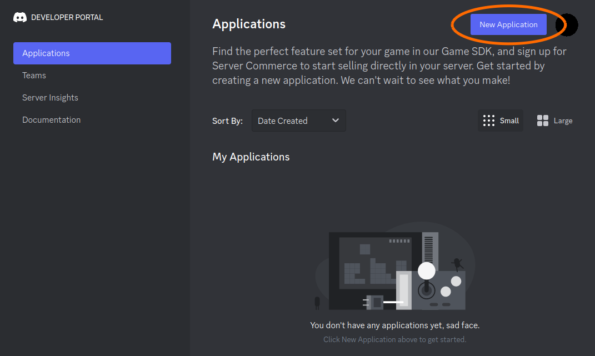
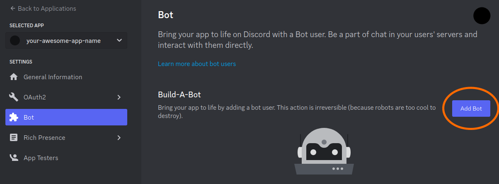
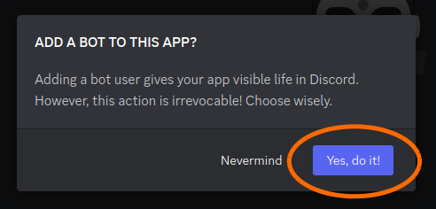
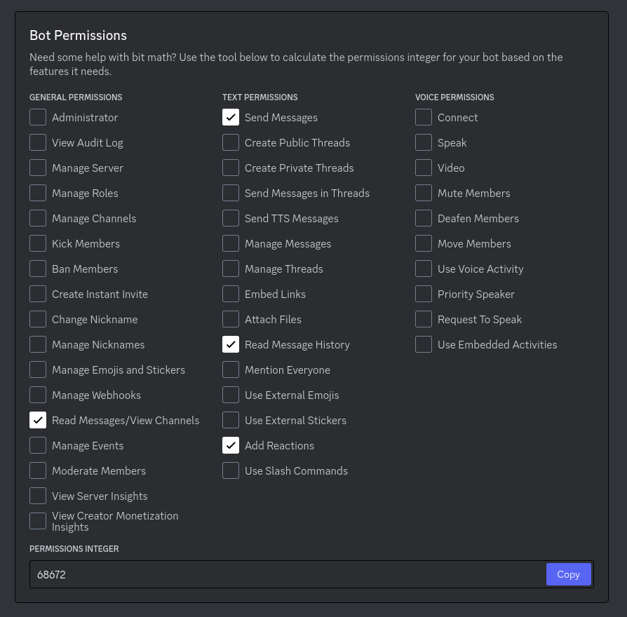
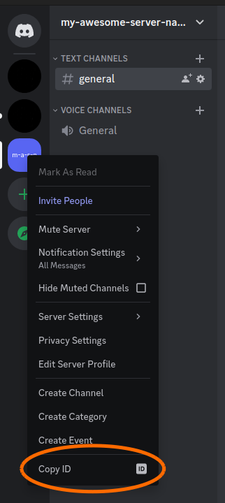
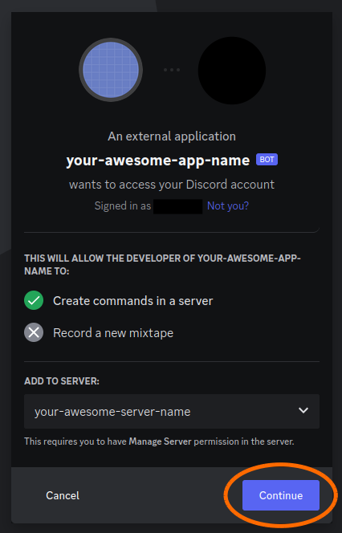
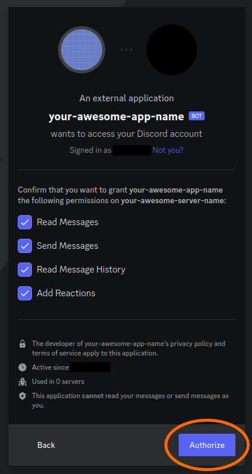

# Discord Bot

> Very lightweight Discord bot.
Written in TypeScript, based on [discord.js](https://discord.js.org).

---

1. [Setup](#setup)
    1. [Development Environment Setup](#development-environment-setup)
        1. [DirEnv](#direnv)
        2. [Yarn PnP Installs](#yarn-pnp-installs)
    2. [Discord Integration](#discord-integration)
        1. [The Discord Bot Token](#the-discord-bot-token)
        2. [The Discord Guild ID](#the-discord-guild-id)
        3. [Inviting the Bot to Discord](#inviting-the-bot-to-discord)
    3. [`.env` Setup](#env-setup)

---

## Setup

Setting up this project entails two main parts:

1. setting up your development environment (we'll show detailed steps for VSCode under Linux, but you can pretty much use whatever works for you), and
2. setting up the integration with Discord.

We'll tackle each in turn and guide you through the whole ordeal.

### Development Environment Setup

First, we'll install `direnv`, then we'll set VSCode up to understand [Yarn PnP Installs](https://yarnpkg.com/features/pnp).

#### DirEnv

To make your life _superbly_ easier, you'll need to install [DirEnv](https://direnv.net).
This mostly entails installing the `direnv` package in your distro and [hooking DirEnv to your shell](https://direnv.net/docs/hook.html).
Finally, be sure to allow DirEnv to run on this project's root:

```sh
direnv allow .
```

If you're using VSCode, consider installing [the `direnv` extension](https://marketplace.visualstudio.com/items?itemName=mkhl.direnv), this will teach VSCode how to read your [`.envrc`](./.envrc) files.

#### Yarn PnP Installs

VSCode needs some help in dealing with Pnp Installs.

To begin, we'll need the [ZipFS](https://marketplace.visualstudio.com/items?itemName=arcanis.vscode-zipfs) VSCode extension (this is required because Yarn PnP Installs keep packages compressed and navigating within them would fail otherwise).

Next, we need to update all Yarn packages:

```sh
yarn
```

Now we need to ask Yarn to generate the required SDKs:

```sh
yarn dlx @yarnpkg/sdks vscode
```

At this point, VSCode will ask us if we want to use the Workspace-provided Typescript compiler, to which we should answer yes.

If you have any troubles with this step, please see [the official Yarn documentation](https://next.yarnpkg.com/getting-started/editor-sdks#vscode) for more details.

### Discord Integration

Integrating with Discord will entail generating / finding two specific values:

1. the Discord Bot Token, and
2. the Discord Guild ID.

We'll treat each in turn.

#### The Discord Bot Token

The first thing you need to do is create a new application on the [Discord Developer Portal](https://discord.com/developers):



Give your new application a flashy new name:


<!-- markdownlint-disable-next-line MD033 -->
<a id="copy-application-id"></a>Be sure to copy the application ID, we'll need it later:


Now let's add a bot to your newly-created application:



And confirm our choice:



Give your new boy a flashy new name:


Finally, let's give the bot the **Message Content Intent** Privileged Gateway Intent:


Although not technically required, you may verify that the permission bitmap value we'll use further down (ie. `68672`) does not contain any spurious permissions by checking the Bot Permissions Calculator:



After all this fooling around, let's wrap up the bot integration by resetting the bot token:


Don't mind the FUD:


<!-- markdownlint-disable-next-line MD033 -->
<a id="discord-bot-token"></a>And copy the value revealed:


Now, it's **very** important that you paste this value in a safe place, at least until we finish the integration and configuration steps, since we'll need it [further down](#env-setup).

#### The Discord Guild ID

If you've managed this far, this is going to be a breeze.
Simply go to the Discord application, look for the server you want the bot to appear, right-click on it, and select "Copy ID":



Paste this value somewhere safe, we'll need it [further down](#env-setup).

#### Inviting the Bot to Discord

In order to invite the bot you just created, you'll need to build an _invite URL_... don't worry, it's **really** easy.
Just copy this URL replacing `YOUR_DISCORD_APPLICATION_ID` with [the value we saved before](#copy-application-id):

```text
https://discord.com/oauth2/authorize?client_id=YOUR_DISCORD_APPLICATION_ID&scope=bot&permissions=68672
```

Navigating to it will greet you with:



Finally, confirm the permissions set above:



And... you're done!
**Congratulations!**

### `.env` Setup

Every _runtime_ datum in the project will be directed by the `.env` file.
You don't have an `.env` file yet, let's fix that.

Copy [`.env.example`](./.env.example) to `.env`:

```sh
cp .env.example .env
```

This will leave you with an `.env` file like:

```sh
# shellcheck disable=SC2148,SC2034

# Discord
DISCORD_BOT_TOKEN="YOUR_DISCORD_BOT_TOKEN"
DISCORD_GUILD_ID="YOUR_DISCORD_GUILD_ID"
```

Now is the time for our hard work to bear fruit.
You need to change the placeholder values (ie. `YOUR_...` strings) to the values we extracted before:

1. replace `YOUR_DISCORD_BOT_TOKEN` with the value we copied [here](#discord-bot-token),
2. replace `YOUR_DISCORD_GUILD_ID` with the value we copied [here](#the-discord-guild-id),

Finally, let's ask DirEnv to reload our environment to pick up the new `.env` changes:

```sh
direnv reload
```

## Running the Bot

To run the bot in development mode type `yarn dev`.
This should only be used during the development process, use the production mode for deployments.

To run the bot in production mode type `yarn prod`, this will compile the typescript code and execute the generated javascript code with Node.js.
